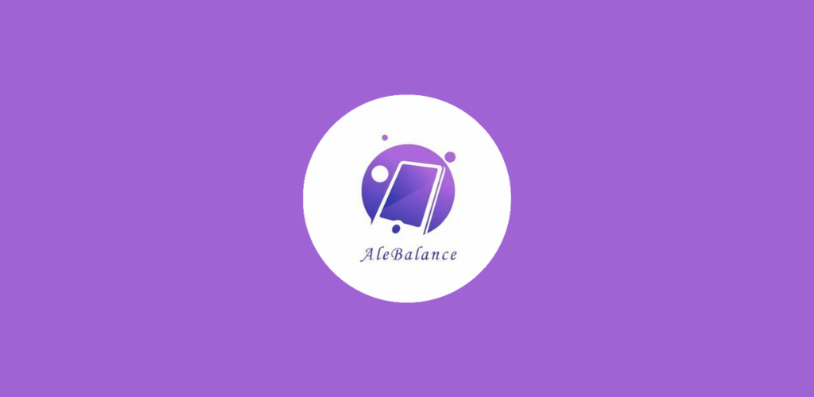
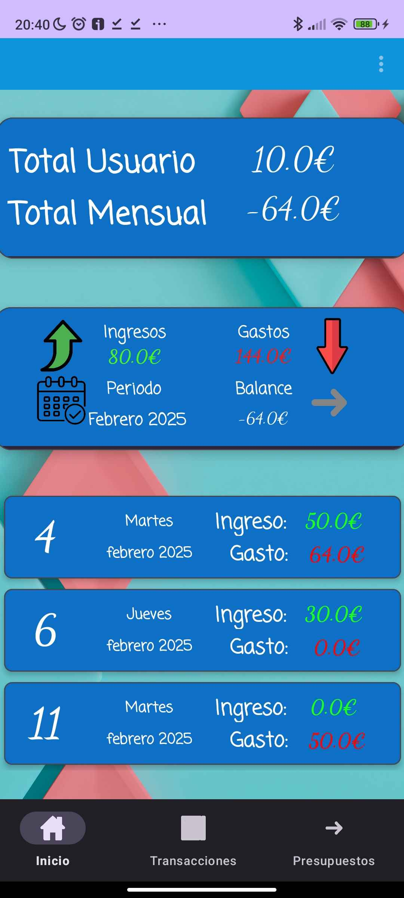
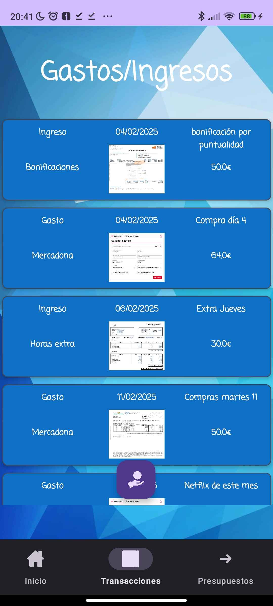
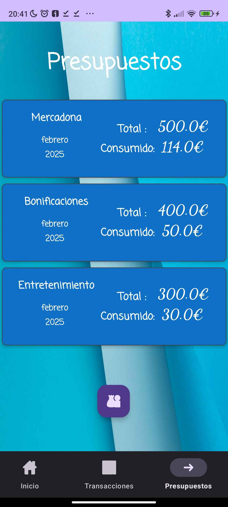

# AleBalance

> App Android nativa para el control de finanzas personales: ingresos, gastos, categorías y seguimiento mensual de presupuestos.

**Proyecto del Grado Superior en Desarrollo de Aplicaciones Web (DAW) — FP Solvam, 2025.**
Asignatura: Diseño de Interfaces Web.

<p align="center">
  
</p>

---

## Sobre la app

AleBalance es una app móvil que permite al usuario **gestionar y controlar sus gastos e ingresos** de manera sencilla. Está pensada para uso personal, sin necesidad de conexión a internet ni cuentas externas: toda la información se guarda **localmente en el dispositivo** mediante SQLite.

La filosofía es: que en menos de tres toques puedas registrar un gasto, ver cuánto has gastado este mes en una categoría, y saber si estás cumpliendo tu presupuesto.

## Funcionalidades

### Inicio
- Resumen del **balance mensual** (ingresos, gastos, total acumulado).
- Vista de las transacciones agrupadas por día del mes.
- **Cambio de mes** desde la tarjeta principal (navegar al pasado o al futuro).

### Transacciones
- CRUD completo: crear, editar y eliminar transacciones.
- Categorías **personalizables** (alta y baja).
- Filtros por mes y por día.
- Cada transacción **actualiza automáticamente** el seguimiento del presupuesto asociado.

### Presupuestos
- Asignación de un **presupuesto mensual por categoría**.
- Seguimiento automático: al crear/editar/eliminar una transacción de esa categoría, el presupuesto se recalcula.
- Visualización del nivel de cumplimiento del objetivo del mes.

### Otros detalles
- **Modo claro / modo oscuro** (tema noche).
- Selector de imágenes integrado (recursos por categoría).
- Interfaz **Material Design**.

## Capturas

| Inicio | Transacciones | Presupuestos |
|---|---|---|
|  |  |  |

## Stack técnico

| Capa | Tecnología |
|---|---|
| Lenguaje | **Kotlin** |
| Plataforma | **Android SDK** (minSdk según proyecto) |
| Persistencia | **SQLite** (mediante `SQLiteOpenHelper` personalizado) |
| UI | XML layouts + **Material Components** + RecyclerView con adaptadores propios |
| Imágenes | Image Picker nativo de Android |
| Build system | Gradle (Kotlin DSL) |

## Arquitectura

Estructura típica de app Android multi-Activity con persistencia local:

```
app/src/main/java/es/solvam/alebalance/
  MainActivity.kt              # Pantalla principal
  Transacciones.kt             # Listado y gestión de transacciones
  Categorias.kt                # Gestión de categorías
  Presupuestos.kt              # Gestión de presupuestos mensuales
  DiasTotales.kt               # Resumen por día del mes
  SeleccionFechas.kt           # Filtro/selector de fechas
  AcercaDe.kt                  # Información de la app
  AplicacionDBHelper.kt        # SQLiteOpenHelper - esquema y queries
  Categoria.kt / Presupuesto.kt # Modelos de datos
  AdaptadorDias.kt             # RecyclerView adapters
  AdaptadorTransacciones.kt
  AdaptadorPresupuestos.kt
  ImagePickerManager.kt        # Utilidad para seleccionar imágenes
```

## Probar la app

### Opción A — Instalar el APK directamente
1. Descarga el archivo [`AleBalance-debug.apk`](AleBalance-debug.apk) de este repositorio.
2. Pásalo a tu móvil Android.
3. Permite la instalación de orígenes desconocidos e instálalo.

### Opción B — Compilar desde código
1. Clona el repositorio: `git clone https://github.com/Alejandro428/alebalance.git`
2. Abre el proyecto en **Android Studio** (Hedgehog o superior).
3. Sincroniza Gradle y ejecuta en un emulador o dispositivo físico.

## Autor

**Alejandro Jiménez Cabrera** — Desarrollador Web Junior, Valencia
- GitHub: [@Alejandro428](https://github.com/Alejandro428)
- Email: alejandrojimenez4286@gmail.com

## Licencia

Proyecto educativo desarrollado durante el Grado Superior DAW.
